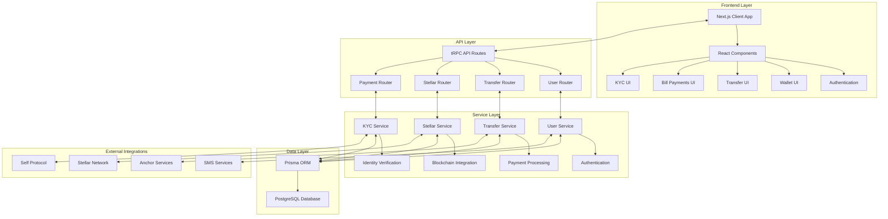
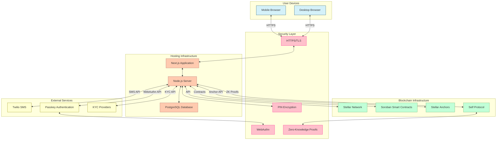
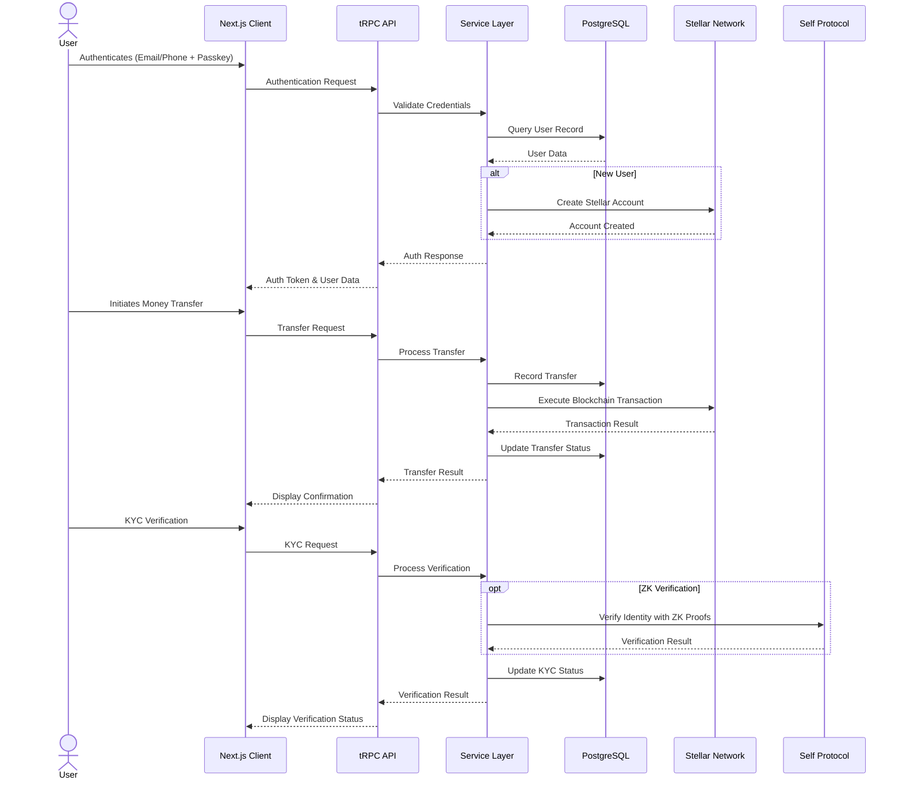

# Druid - Secure Financial Platform


Druid is a modern financial application that bridges traditional banking with blockchain technology, providing secure money transfers, bill payments, and wallet management with robust security features.

## Table of Contents

- [Features](#features)
- [Architecture](#architecture)
- [Technical Infrastructure](#technical-infrastructure)
- [How It Works](#how-it-works)
- [Installation](#installation)
- [Development](#development)
- [Production](#production)
- [Security Considerations](#security-considerations)
- [Technical Innovation](#technical-innovation)
- [Real-World Impact](#real-world-impact)
- [User Experience](#user-experience)
- [Completion Level](#completion-level)
- [Presentation](#presentation)
- [Roadmap](#roadmap)
- [Contributing](#contributing)
- [License](#license)

## Features

### 1. Digital Wallet
- Personal wallet address for each user
- Balance tracking and transaction history
- QR code scanning for quick payments
- Support for multiple currencies

### 2. Money Transfers
- Send money to recipients via phone number or email
- Multiple payment methods:
  - Bank transfers
  - Cash payments
  - MoneyGram collection

### 3. Bill Payments
- Pay various utility bills:
  - Electricity
  - Water
  - Internet
  - Phone
  - Rent
  - Credit Card

### 4. Security
- PIN verification for sensitive transactions
- Passkey authentication option
- Biometric authentication support
- Secure transaction signing

### 5. KYC Integration
- Identity verification workflow
- Document upload and verification
- Compliance with financial regulations

## Architecture

### Frontend
- **Next.js**: React framework with server-side rendering
- **React**: Component-based UI library
- **TypeScript**: Type-safe JavaScript
- **Tailwind CSS**: Utility-first CSS framework
- **shadcn/ui**: Reusable UI components

### Backend
- **tRPC**: End-to-end typesafe API
- **Prisma**: Type-safe database ORM
- **PostgreSQL**: Relational database
- **Stellar SDK**: Integration with Stellar blockchain

### State Management
- **React Query**: Data fetching and caching
- **Zustand**: Lightweight state management
- **Local Storage**: Persistence for session data

### Authentication & Security
- **Passkey Kit**: WebAuthn/FIDO2 passkey implementation
- **bcryptjs**: Secure password hashing
- **Custom PIN verification**: 6-digit PIN security

### System Architecture Diagram



## Technical Infrastructure

### API Structure
- **tRPC Routers**: Type-safe API endpoints
  - `/api/trpc/[trpc]/route.ts`: API entry point
  - Routers for transfers, users, stellar operations

### Database Schema
- Users with wallet associations
- Transfers with transaction history
- Bills and payment records
- Currencies and exchange rates

### Blockchain Integration
- **Stellar Network**: For secure transactions
- **Soroban**: Smart contract platform
- **SACClient**: Stellar Asset Contract client

### ZK Verification Integration
- **Self Protocol**: Privacy-preserving passport verification via Zero-Knowledge proofs
- **Front-end SDK**: QR code generation for verification requests
- **Back-end SDK**: Verification of ZK proofs with customizable compliance rules
- **OFAC Compliance**: Built-in screening while preserving user privacy

### Infrastructure Diagram



### Data Flow Diagram



### Environment Configuration
- Type-safe environment variables via `@t3-oss/env-nextjs`
- Configuration for both server and client

## How It Works

### User Flow
1. **Authentication**: Sign up/in via email, phone, or passkey
2. **Wallet Creation**: Generate or connect to an existing wallet
3. **Fund Management**: View balance and transaction history
4. **Transfers**: Send money to recipients through various channels
5. **Bill Payments**: Pay bills securely with PIN verification

### Transfer Process
1. User initiates a transfer with recipient details
2. System generates a transfer record
3. User selects payment method (bank transfer, cash, etc.)
4. PIN verification ensures security
5. Transfer is executed and confirmed
6. Both sender and recipient get notifications

### Bill Payment Process
1. User selects bill type
2. Enters account information and amount
3. Verifies payment with PIN
4. System processes payment
5. Confirmation is provided to the user

## Installation

### Prerequisites
- Node.js (v18+)
- PostgreSQL
- Yarn package manager

### Environment Setup
1. Clone the repository
2. Copy `.env.example` to `.env` and configure the following environment variables:

```bash
# Database Configuration
DATABASE_URL="postgres://<username>:<password>@<host>:<port>/<database>?sslmode=require"
DIRECT_URL="postgres://<username>:<password>@<host>:<port>/<database>?sslmode=require"

# Node Environment
NODE_ENV="development"  # Options: development, test, production

# Stellar/Anchor API Configuration
ANCHOR_API_BASE_URL="http://extmgxanchor.moneygram.com/"
ANCHOR_API_TOKEN="your_anchor_api_token"
STELLAR_HORIZON_URL="https://horizon-testnet.stellar.org"

# Smart Contract Configuration
ESCROW_CONTRACT_ADDRESS="CC3CFRC6ZLWPG3M6JJSUMY3L7MYA34R3QK3VES7LHHWUFMW7YRWW4ZBL"
RPC_URL="https://soroban-testnet.stellar.org"
DRUID_DISTRIBUTOR_PUBLIC_KEY="GDUZK2USSJJPMDFIT65VXR3JTU3QDONTXTTGK4H4B4Z2ZD7QWAUUGAXN"
DRUID_DISTRIBUTOR_SECRET_KEY="your_secret_key"
NATIVE_CONTRACT_ID="CDLZFC3SYJYDZT7K67VZ75HPJVIEUVNIXF47BEA6SLY2MIGWXMRQ6GU5"
USDC_SAC="CBIELTK6YBZJU5UP2WWQEUCYKLPU6AUNZ2BQ4WWFEIE3USCIHMXQDAMA"
SRT_ASSET_ID="GCDNJUBQSX7AJWLJACMJ7I4BC3Z47BQUTMHEICZLE6MU4KQBRYG5JY6B"

# Passkey Service URLs
LAUNCHTUBE_URL="https://testnet.launchtube.xyz"
MERCURYT_URL="https://api.mercurydata.app"
LAUNCHETUBE_JWT="your_launchetube_jwt"
MERCURY_JWT="your_mercury_jwt"

# SMS & Authentication Configuration
ENABLE_SMS="true"
SALT_ROUNDS="10"
MOCK_KYC="true"  # Set to true to bypass actual KYC API calls in development
TWILIO_ACCOUNT_SID="your_twilio_account_sid"  # Required if ENABLE_SMS is true
TWILIO_AUTH_TOKEN="your_twilio_auth_token"    # Required if ENABLE_SMS is true
TWILIO_PHONE_NUMBER="your_twilio_phone_number"  # Required if ENABLE_SMS is true

# Client-Side Environment Variables (prefixed with NEXT_PUBLIC_)
NEXT_PUBLIC_RPC_URL="https://soroban-testnet.stellar.org"
NEXT_PUBLIC_FACTORY_CONTRACT_ID="your_factory_contract_id"
NEXT_PUBLIC_NATIVE_CONTRACT_ID="CDLZFC3SYJYDZT7K67VZ75HPJVIEUVNIXF47BEA6SLY2MIGWXMRQ6GU5"
NEXT_PUBLIC_NETWORK_PASSPHRASE="Test SDF Network ; September 2015"
NEXT_PUBLIC_APP_URL="https://your-app-url.com"
NEXT_PUBLIC_PUSHER_APP_KEY="your_pusher_app_key"  # Required for real-time features
```

#### Environment Variables Explanation

1. **Database Configuration**
   - `DATABASE_URL` & `DIRECT_URL`: PostgreSQL connection strings for Prisma
   
2. **Stellar Integration**
   - `STELLAR_HORIZON_URL`: URL for Stellar Horizon API
   - `RPC_URL`: URL for Soroban RPC
   - `NEXT_PUBLIC_NETWORK_PASSPHRASE`: Stellar network identifier
   - `ESCROW_CONTRACT_ADDRESS`: Address of the escrow smart contract
   - `NATIVE_CONTRACT_ID` & `NEXT_PUBLIC_NATIVE_CONTRACT_ID`: Contract ID for native asset operations
   - `DRUID_DISTRIBUTOR_PUBLIC_KEY` & `DRUID_DISTRIBUTOR_SECRET_KEY`: Keys for the distributor account
   
3. **Passkey Authentication**
   - `LAUNCHTUBE_URL` & `LAUNCHETUBE_JWT`: For passkey registration
   - `MERCURYT_URL` & `MERCURY_JWT`: For Mercury data API
   - `NEXT_PUBLIC_FACTORY_CONTRACT_ID`: Contract ID for passkey factory
   
4. **SMS & Authentication**
   - `ENABLE_SMS`: Toggle SMS functionality
     - When set to `"false"`, the system will use a hardcoded OTP code "980433" for all verifications
     - When set to `"true"`, SMS will be sent via Twilio
   - `TWILIO_ACCOUNT_SID`, `TWILIO_AUTH_TOKEN`, `TWILIO_PHONE_NUMBER`: Twilio credentials for SMS
   - `SALT_ROUNDS`: Security parameter for password hashing
   - `MOCK_KYC`: Toggle to bypass real KYC checks in development

5. **Anchor Integration**
   - `ANCHOR_API_BASE_URL` & `ANCHOR_API_TOKEN`: For connecting to the Stellar Anchor
   - `SRT_ASSET_ID`: Asset ID for SRT token
   - `USDC_SAC`: Stellar Asset Contract for USDC

6. **Self Protocol Integration** (Coming Soon)
   - Front-end: `npm install @selfxyz/qrcode` or `yarn add @selfxyz/qrcode`
   - Back-end: `npm install @selfxyz/core` or `yarn add @selfxyz/core`
   - Required environment variables will include:
     ```
     CELO_RPC_URL=https://forno.celo.org
     SCOPE=druid-app-verification
     ```

### Installation Steps
```bash
# Install dependencies
yarn install

# Generate Prisma client
yarn prisma generate

# Set up the database
yarn db:push
```

## Development

```bash
# Start development server
yarn dev

# With HTTPS (for testing WebAuthn/passkeys)
yarn dev:https
```

### Database Management
```bash
# Create a new migration
yarn db:generate

# Apply migrations
yarn db:migrate

# View database with Prisma Studio
yarn db:studio
```

## Production

```bash
# Build the application
yarn build

# Start production server
yarn start
```

## Security Considerations

- All sensitive data is encrypted
- PIN and biometric verification for transactions
- Passkey support for passwordless authentication
- Stellar blockchain for secure transaction records
- ZK Self verification for privacy-preserving identity verification

## Technical Innovation

### Code Quality
- **Type Safety**: Comprehensive TypeScript typing throughout the application
- **Modular Architecture**: Well-structured component organization with clear separation of concerns
- **Best Practices**: Adherence to modern React patterns and Next.js conventions
- **Testing**: Comprehensive test coverage for critical components

### Technical Complexity
- **Distributed Systems**: Integration of multiple financial services through a unified interface
- **Financial Logic**: Complex transaction handling with validation and error recovery
- **State Management**: Sophisticated state management for multi-step processes
- **Multi-platform Compatibility**: Responsive design working across devices

### Innovative Use of Blockchain
- **Stellar Integration**: Using Stellar's network for secure, fast, and low-cost transactions
- **Smart Contract Implementation**: Leveraging Soroban for programmable financial logic
- **Trustless Operations**: Implementing escrow services without centralized authority
- **Cross-border Capabilities**: Facilitating international transfers with minimal friction
- **Zero-Knowledge Proofs**: Utilizing Self protocol for privacy-preserving identity verification

## Real-World Impact

### Problem-Solution Fit
- **Addressing Underbanking**: Providing financial services to underserved populations
- **Remittance Challenges**: Reducing costs and delays in cross-border transfers
- **Financial Inclusion**: Enabling access to banking services without traditional banking infrastructure
- **Trust Issues**: Building trust through transparent blockchain transactions

### Potential Scale
- **Global Reach**: Platform designed for international deployment
- **Scalable Infrastructure**: Cloud-native architecture supporting millions of users
- **Network Effects**: Increasing value as user base grows
- **Multi-currency Support**: Ready for deployment across different economic regions

### Market Viability
- **Competitive Analysis**: Lower fees than traditional remittance services
- **Target Market**: Clear focus on both banked and underbanked populations
- **Revenue Model**: Sustainable fee structure with growth opportunities
- **Regulatory Compliance**: Built with KYC/AML considerations from the ground up
- **Privacy-Preserving Verification**: Using ZK proofs via Self protocol for compliant yet private identity verification

## User Experience

### Interface Design
- **Clean Aesthetics**: Modern, minimalist UI that emphasizes content
- **Visual Hierarchy**: Clear organization of information and actions
- **Consistency**: Uniform design language across all application sections
- **Responsive Design**: Optimized for both mobile and desktop experiences

### User Flow
- **Intuitive Navigation**: Clear pathways through complex financial processes
- **Reduced Friction**: Minimized steps to complete common actions
- **Error Prevention**: Proactive validation to prevent user mistakes
- **Guided Journeys**: Step-by-step flows for complex operations

### Accessibility
- **WCAG Compliance**: Following web content accessibility guidelines
- **Screen Reader Support**: Semantic HTML with proper ARIA attributes
- **Keyboard Navigation**: Full functionality without mouse interaction
- **Color Contrast**: Ensuring readability for users with visual impairments

## Completion Level

### Working Prototype
- **Core Functionality**: All essential features implemented and functional
- **End-to-End Flows**: Complete user journeys from registration to transaction
- **API Integration**: Connected to all necessary external services
- **Error Handling**: Robust handling of edge cases and failure scenarios

### Feature Completeness
- **MVP Features**: All planned features for initial release implemented
- **Polish Level**: Refined user interactions and visual design
- **Performance Optimization**: Efficient loading and operation times
- **Mobile Readiness**: Fully functional on mobile devices

### Documentation Quality
- **Comprehensive Coverage**: Documentation for all aspects of the application
- **Technical Depth**: Detailed explanations of architecture and implementation
- **Onboarding Focus**: Clear guidance for new developers and users
- **Maintenance Support**: Guidelines for ongoing development and updates

## Presentation

### Project Pitch

Druid represents a transformative approach to global financial inclusion, solving critical problems in cross-border payments while leveraging cutting-edge blockchain technology in a user-friendly interface.

#### The Problem We're Solving

Today, over 1.7 billion adults remain unbanked worldwide, while existing remittance services charge exorbitant fees (averaging 6-8%) that cost migrants $50 billion annually. Cross-border payments remain slow (2-5 days), expensive, and lack transparency, particularly affecting vulnerable populations who need these services most.

Traditional financial systems create barriers through:
- High fees and unfavorable exchange rates
- Extensive paperwork and documentation requirements
- Limited accessibility in rural or underserved areas
- Lack of transparency in transaction status and fees
- Exclusion of individuals without formal banking relationships

#### Our Solution: Druid

Druid provides a comprehensive digital financial platform that bridges traditional and blockchain technologies to enable:

1. **Instant & Low-Cost Transfers**: Reduce remittance costs by up to 70% and settlement time from days to seconds using Stellar's high-throughput blockchain.

2. **Multiple Access Points**: Cash deposits, bank transfers, or mobile money - users can access funds through their preferred method without requiring a bank account.

3. **Transparent & Secure**: Every transaction is recorded on the blockchain with real-time tracking and military-grade encryption, while maintaining regulatory compliance.

4. **Privacy-Preserving Compliance**: Our integration of Zero-Knowledge proofs through Self Protocol allows for regulatory compliance without compromising user privacy.

5. **True Financial Inclusion**: By combining the accessibility of cash-based systems with the efficiency of blockchain, we serve both banked and unbanked populations.

#### Competitive Advantage

Druid stands apart from both traditional remittance services and crypto-native solutions:

| Feature | Traditional Services | Crypto-Only Solutions | Druid |
|---------|----------------------|------------------------|-------|
| **Cost** | 6-8% average fees | 1-2% fees but complex | **1-2% transparent fees** |
| **Speed** | 2-5 days | Minutes to hours | **Seconds to minutes** |
| **Accessibility** | Requires documentation | Requires technical knowledge | **Multiple options for all users** |
| **Compliance** | High but invasive | Often lacking | **Strong but privacy-preserving** |
| **User Experience** | Varies but improving | Often complex | **Simple, intuitive design** |

#### Market Opportunity

The global remittance market exceeds $700 billion annually and is growing at 4-5% per year, while digital wallet adoption is projected to reach 60% of the global population by 2026. By targeting key remittance corridors (US-Mexico, US-Philippines, EU-Africa) initially, Druid addresses an immediate $200+ billion market with our differentiated solution.

#### Business Model

Our sustainable revenue model includes:
- Small transaction fees (1-2%, significantly lower than industry standard)
- Premium features for power users and businesses
- Currency exchange margin (minimal and transparent)
- Ecosystem partnerships with merchants and service providers

#### Why Now?

Three converging factors make this the perfect time for Druid:
1. Accelerated digital payment adoption post-pandemic
2. Maturing blockchain infrastructure (Stellar, Soroban) enabling practical applications
3. Regulatory frameworks evolving to support responsible innovation in financial services

#### Vision & Impact

Beyond remittances, Druid is building toward a future where financial services are:
- **Universal**: Available to everyone regardless of geography or economic status
- **Fair**: Transparent fees and access conditions
- **Sovereign**: Users control their own data and financial information
- **Interoperable**: Working seamlessly across various financial systems

By removing financial barriers, we enable economic empowerment for millions globally, helping families increase discretionary income, build savings, and ultimately break cycles of poverty.

#### Team Commitment

Our team combines expertise in blockchain development, financial inclusion, regulatory compliance, and user experience design. We're committed to building a platform that makes a meaningful difference in people's lives while establishing a sustainable business that can scale globally.

Join us in transforming the future of global finance with Druid - where traditional finance meets cutting-edge technology to create true financial inclusion.

## Roadmap

### 2023 (Completed)
- Initial platform launch
- Basic wallet functionality
- Payment integration (Bank transfer, Cash)
- Security foundation with PIN verification
- KYC integration
- Bill payment services

### 2024 (Completed)
- Enhanced security with passkeys
- MoneyGram collection integration
- Multi-currency support
- User experience improvements
- Transaction history and analytics
- Mobile application development
- Merchant payment solutions
- Enhanced notification system

### 2025 (Current)
- **Soroban Escrow Contract Integration**: Trustless escrow services using Soroban smart contracts
- **Buy Now, Pay Later (BNPL) Service**: BNPL functionality allowing users to split payments into installments
- **ZK Self Protocol Integration**: Privacy-preserving identity verification using Self protocol's Zero-Knowledge proofs
- **Enhanced Security Features**: Advanced fraud detection and prevention systems
- **Cross-Border Optimization**: Improved routing for international transfers
- **Regulatory Compliance Updates**: Adapting to evolving global financial regulations

### 2026 (Planned)
- **AI-Powered Financial Assistant**: Integration of AI prompts to help users with financial decisions
- **Voice Command System**: Implementation of voice prompts for hands-free operation
- **Advanced ZK Verification Features**: Expanding Self protocol integration with additional verification options
- **International Expansion**: Strategic entry into new markets in Asia and Latin America
- **DeFi Integration**: Smart yield generation options for wallet balances
- **Merchant Ecosystem Development**: Enhanced tools for businesses to accept and manage payments

### 2027-2028 (Future Vision)
- **Cross-Chain Interoperability**: Seamless transfers between multiple blockchain networks
- **Central Bank Digital Currency (CBDC) Integration**: Support for emerging government-backed digital currencies
- **Advanced Smart Contract Solutions**: Programmable money features for businesses and institutions
- **Embedded Finance API**: Allow third-party applications to leverage Druid's infrastructure
- **Financial Education Platform**: Built-in learning resources to improve financial literacy
- **Institutional-Grade Services**: Solutions designed for banks and financial institutions

### Market Acquisition Strategy (100,000 Users by End of 2026)

Our plan to scale from our current user base to 100,000 users by the end of 2026:

1. **Geographic Expansion**:
   - Deepen penetration in existing high-remittance corridors (US-Mexico, US-Philippines, Europe-Africa)
   - Expand into emerging markets in Southeast Asia and Latin America
   - Target diaspora communities in major global cities

2. **Growth Acceleration**:
   - **Enhanced Referral Program**: Multi-tiered rewards with permanent fee reductions
   - **Strategic Partnerships**: Collaborate with universities, employers of migrant workers, and community organizations
   - **Business Platform**: Dedicated solutions for small businesses serving immigrant communities
   - **Financial Institution Partnerships**: White-label solutions for banks and credit unions

3. **Advanced Marketing Strategy**:
   - Targeted digital campaigns focused on key use cases and pain points
   - Content marketing highlighting real user success stories
   - Community-driven growth through ambassador programs
   - Educational initiatives addressing specific financial needs of target demographics

4. **Innovation-Driven Acquisition**:
   - Early access to new BNPL features for qualified users
   - Privacy-focused marketing highlighting ZK verification benefits
   - AI-powered personalization to improve user retention and engagement
   - Cross-product incentives linking remittances with other financial services

5. **Enterprise Strategy**:
   - B2B solutions for companies with global workforces
   - Integration with payroll systems for direct deposit options
   - APIs for third-party application developers
   - Customized compliance solutions for businesses in regulated sectors

Our growth strategy balances organic user acquisition with strategic partnerships, with quarterly targets and clear metrics for success tracking across all channels and markets.

## Contributing

We welcome contributions to Druid! Please see our [Contributing Guidelines](CONTRIBUTING.md) for more information.

## License

This project is licensed under the [MIT License](LICENSE). 