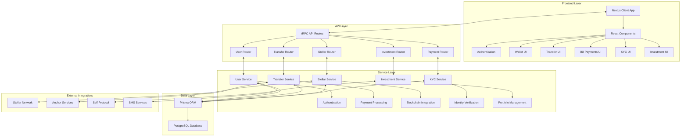
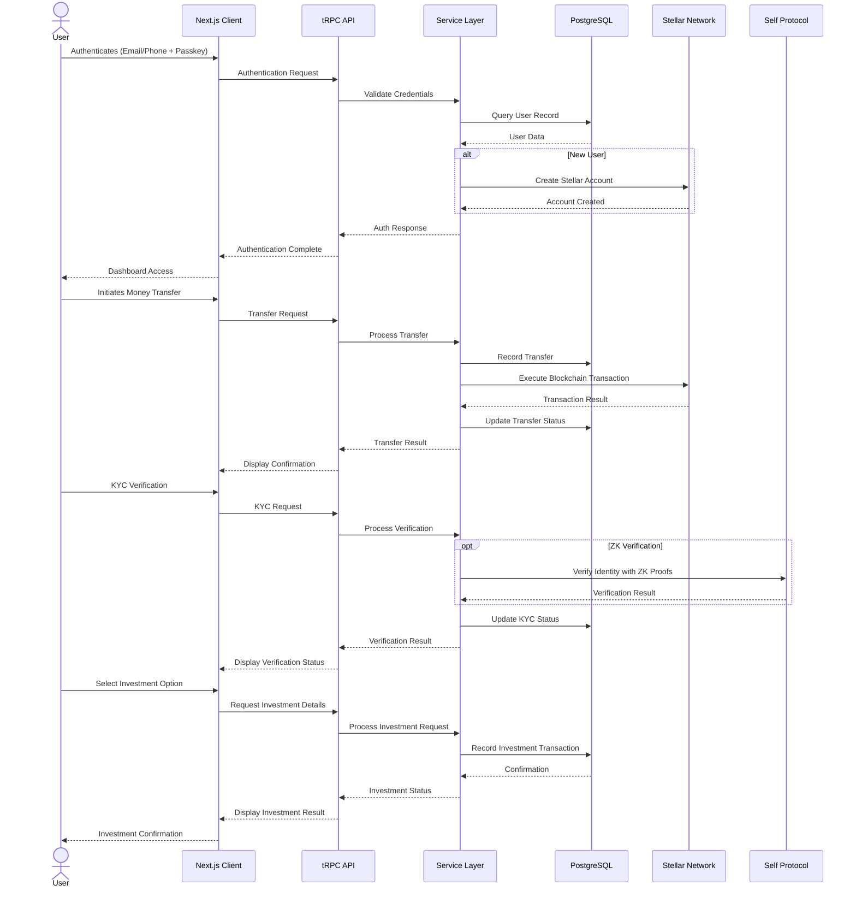

# Druid - Secure Financial Platform


Druid is a modern financial application that bridges traditional banking with blockchain technology, providing secure money transfers, bill payments, and wallet management with robust security features.

## Table of Contents

- [Features](#features)
- [Architecture](#architecture)
- [Technical Infrastructure](#technical-infrastructure)
- [How It Works](#how-it-works)
- [Investments Platform](#investments-platform)
- [Installation](#installation)
- [Development](#development)
- [Production](#production)
- [Security Considerations](#security-considerations)
- [Technical Innovation](#technical-innovation)
- [Real-World Impact](#real-world-impact)
- [User Experience](#user-experience)
- [Completion Level](#completion-level)
- [Presentation](#presentation)
- [Roadmap](#roadmap)
- [Contributing](#contributing)
- [License](#license)

## Features

### 1. Digital Wallet
- Personal wallet address for each user
- Balance tracking and transaction history
- QR code scanning for quick payments
- Support for multiple currencies

### 2. Money Transfers
- Send money to recipients via phone number or email
- Multiple payment methods:
  - Bank transfers
  - Cash payments
  - MoneyGram collection

### 3. Bill Payments
- Pay various utility bills:
  - Electricity
  - Water
  - Internet
  - Phone
  - Rent
  - Credit Card

### 4. Security
- PIN verification for sensitive transactions
- Passkey authentication option
- Biometric authentication support
- Secure transaction signing

### 5. KYC Integration
- Identity verification workflow
- Document upload and verification
- Compliance with financial regulations

### 6. Investment Platform
- Diversified investment options:
  - **Savings Plans**: Low-risk options with stable returns
  - **Stock Market**: Medium-risk equity investments
  - **Cryptocurrency**: High-risk digital asset investments
- Interactive investment simulator with real-time calculations
- Detailed investment metrics and performance tracking
- Customizable investment amounts with minimum thresholds
- Risk assessment and categorization (Low/Medium/High)
- Historical performance data for informed decision-making
- Mobile-responsive investment dashboard

## Architecture

### Frontend
- **Next.js**: React framework with server-side rendering
- **React**: Component-based UI library
- **TypeScript**: Type-safe JavaScript
- **Tailwind CSS**: Utility-first CSS framework
- **shadcn/ui**: Reusable UI components

### Backend
- **tRPC**: End-to-end typesafe API
- **Prisma**: Type-safe database ORM
- **PostgreSQL**: Relational database
- **Stellar SDK**: Integration with Stellar blockchain

### State Management
- **React Query**: Data fetching and caching
- **Zustand**: Lightweight state management
- **Local Storage**: Persistence for session data

### Authentication & Security
- **Passkey Kit**: WebAuthn/FIDO2 passkey implementation
- **bcryptjs**: Secure password hashing
- **Custom PIN verification**: 6-digit PIN security

### System Architecture Diagram



## Technical Infrastructure

### API Structure
- **tRPC Routers**: Type-safe API endpoints
  - `/api/trpc/[trpc]/route.ts`: API entry point
  - Routers for transfers, users, stellar operations

### Database Schema
- Users with wallet associations
- Transfers with transaction history
- Bills and payment records
- Currencies and exchange rates
- Investment portfolios and transaction history

### Blockchain Integration
- **Stellar Network**: For secure transactions
- **Soroban**: Smart contract platform
- **SACClient**: Stellar Asset Contract client

### ZK Verification Integration
- **Self Protocol**: Privacy-preserving passport verification via Zero-Knowledge proofs
- **Front-end SDK**: QR code generation for verification requests
- **Back-end SDK**: Verification of ZK proofs with customizable compliance rules
- **OFAC Compliance**: Built-in screening while preserving user privacy

### Infrastructure Diagram


### Data Flow Diagram



### Environment Configuration
- Type-safe environment variables via `@t3-oss/env-nextjs`
- Configuration for both server and client

## How It Works

### User Flow
1. **Authentication**: Sign up/in via email, phone, or passkey
2. **Wallet Creation**: Generate or connect to an existing wallet
3. **Fund Management**: View balance and transaction history
4. **Transfers**: Send money to recipients through various channels
5. **Bill Payments**: Pay bills securely with PIN verification

### Transfer Process
1. User initiates a transfer with recipient details
2. System generates a transfer record
3. User selects payment method (bank transfer, cash, etc.)
4. PIN verification ensures security
5. Transfer is executed and confirmed
6. Both sender and recipient get notifications

### Bill Payment Process
1. User selects bill type
2. Enters account information and amount
3. Verifies payment with PIN
4. System processes payment
5. Confirmation is provided to the user

## Investments Platform

### Overview
Druid's investment platform provides users with a range of investment options across multiple risk categories. The platform is designed to make investing accessible to users with varying levels of financial knowledge and risk tolerance.

### Investment Categories
1. **Savings**
   - Flexible Savings (2.5% APY, Low Risk)
   - Fixed Term Deposit (4.2% APY, Low Risk)
   - High-Yield Savings (5.8% APY, Medium Risk)

2. **Stocks**
   - Global ETF Portfolio (8-12% historical returns, Medium Risk)
   - Tech Growth Fund (12-18% historical returns, High Risk)
   - Dividend Income Fund (6-9% historical returns, Medium Risk)

3. **Cryptocurrency**
   - Stablecoin Yield (7-10% APY, Medium Risk)
   - Blue-Chip Crypto (Variable returns, High Risk)
   - DeFi Yield Farming (8-20% APY, High Risk)

### Technical Implementation
- **Client-Side Components**:
  - Investment dashboard with category selection
  - Detailed investment cards with risk indicators
  - Interactive investment simulator with real-time calculations
  - Mobile-responsive design with adaptive layouts

- **Server-Side Architecture**:
  - Investment data models and portfolio tracking
  - Risk calculation algorithms
  - Return simulation based on historical performance
  - Transaction recording and portfolio management

- **Data Flow**:
  1. User browses investment options by category
  2. User selects specific investment for detailed view
  3. User simulates investment with adjustable amount
  4. User confirms investment and receives confirmation
  5. System records transaction and updates portfolio

### User Experience Features
- Risk visualization with color-coded indicators
- Interactive sliders for amount selection
- Estimated returns calculator for different time horizons
- Comprehensive details including benefits and considerations
- Historical performance data where applicable
- Mobile-optimized interfaces for all screen sizes

### Security Considerations
- Investment simulator is clearly marked as a demo
- Real investments would require additional verification
- Risk disclosures and financial advice disclaimers
- Secure transaction processing and record-keeping

### Dashboard Integration
- Investment options accessible directly from the main dashboard
- Portfolio summary widget showing current investments
- Performance tracking with visual charts and statistics
- One-click access to investment details and transaction history
- Seamless navigation between financial services within the app
- Notifications for important investment events and opportunities

## Installation

### Prerequisites
- Node.js (v18+)
- PostgreSQL
- Yarn package manager

### Environment Setup
1. Clone the repository
2. Copy `.env.example` to `.env` and configure the following environment variables:

```bash
# Database Configuration
DATABASE_URL="postgres://<username>:<password>@<host>:<port>/<database>?sslmode=require"
DIRECT_URL="postgres://<username>:<password>@<host>:<port>/<database>?sslmode=require"

# Node Environment
NODE_ENV="development"  # Options: development, test, production

# Stellar/Anchor API Configuration
ANCHOR_API_BASE_URL="http://extmgxanchor.moneygram.com/"
ANCHOR_API_TOKEN="your_anchor_api_token"
STELLAR_HORIZON_URL="https://horizon-testnet.stellar.org"

# Smart Contract Configuration
ESCROW_CONTRACT_ADDRESS="CC3CFRC6ZLWPG3M6JJSUMY3L7MYA34R3QK3VES7LHHWUFMW7YRWW4ZBL"
RPC_URL="https://soroban-testnet.stellar.org"
DRUID_DISTRIBUTOR_PUBLIC_KEY="GDUZK2USSJJPMDFIT65VXR3JTU3QDONTXTTGK4H4B4Z2ZD7QWAUUGAXN"
DRUID_DISTRIBUTOR_SECRET_KEY="your_secret_key"
NATIVE_CONTRACT_ID="CDLZFC3SYJYDZT7K67VZ75HPJVIEUVNIXF47BEA6SLY2MIGWXMRQ6GU5"
USDC_SAC="CBIELTK6YBZJU5UP2WWQEUCYKLPU6AUNZ2BQ4WWFEIE3USCIHMXQDAMA"
SRT_ASSET_ID="GCDNJUBQSX7AJWLJACMJ7I4BC3Z47BQUTMHEICZLE6MU4KQBRYG5JY6B"

# Passkey Service URLs
LAUNCHTUBE_URL="https://testnet.launchtube.xyz"
MERCURYT_URL="https://api.mercurydata.app"
LAUNCHETUBE_JWT="your_launchetube_jwt"
MERCURY_JWT="your_mercury_jwt"

# SMS & Authentication Configuration
ENABLE_SMS="true"
SALT_ROUNDS="10"
MOCK_KYC="true"  # Set to true to bypass actual KYC API calls in development
TWILIO_ACCOUNT_SID="your_twilio_account_sid"  # Required if ENABLE_SMS is true
TWILIO_AUTH_TOKEN="your_twilio_auth_token"    # Required if ENABLE_SMS is true
TWILIO_PHONE_NUMBER="your_twilio_phone_number"  # Required if ENABLE_SMS is true

# Client-Side Environment Variables (prefixed with NEXT_PUBLIC_)
NEXT_PUBLIC_RPC_URL="https://soroban-testnet.stellar.org"
NEXT_PUBLIC_FACTORY_CONTRACT_ID="your_factory_contract_id"
NEXT_PUBLIC_NATIVE_CONTRACT_ID="CDLZFC3SYJYDZT7K67VZ75HPJVIEUVNIXF47BEA6SLY2MIGWXMRQ6GU5"
NEXT_PUBLIC_NETWORK_PASSPHRASE="Test SDF Network ; September 2015"
NEXT_PUBLIC_APP_URL="https://your-app-url.com"
NEXT_PUBLIC_PUSHER_APP_KEY="your_pusher_app_key"  # Required for real-time features
```

#### Environment Variables Explanation

1. **Database Configuration**
   - `DATABASE_URL` & `DIRECT_URL`: PostgreSQL connection strings for Prisma
   
2. **Stellar Integration**
   - `STELLAR_HORIZON_URL`: URL for Stellar Horizon API
   - `RPC_URL`: URL for Soroban RPC
   - `NEXT_PUBLIC_NETWORK_PASSPHRASE`: Stellar network identifier
   - `ESCROW_CONTRACT_ADDRESS`: Address of the escrow smart contract
   - `NATIVE_CONTRACT_ID` & `NEXT_PUBLIC_NATIVE_CONTRACT_ID`: Contract ID for native asset operations
   - `DRUID_DISTRIBUTOR_PUBLIC_KEY` & `DRUID_DISTRIBUTOR_SECRET_KEY`: Keys for the distributor account
   
3. **Passkey Authentication**
   - `LAUNCHTUBE_URL` & `LAUNCHETUBE_JWT`: For passkey registration
   - `MERCURYT_URL` & `MERCURY_JWT`: For Mercury data API
   - `NEXT_PUBLIC_FACTORY_CONTRACT_ID`: Contract ID for passkey factory
   
4. **SMS & Authentication**
   - `ENABLE_SMS`: Toggle SMS functionality
   - `TWILIO_ACCOUNT_SID`, `TWILIO_AUTH_TOKEN`, `TWILIO_PHONE_NUMBER`: Twilio credentials for SMS
   - `SALT_ROUNDS`: Security parameter for password hashing
   - `MOCK_KYC`: Toggle to bypass real KYC checks in development

5. **Anchor Integration**
   - `ANCHOR_API_BASE_URL` & `ANCHOR_API_TOKEN`: For connecting to the Stellar Anchor
   - `SRT_ASSET_ID`: Asset ID for SRT token
   - `USDC_SAC`: Stellar Asset Contract for USDC

6. **Self Protocol Integration** (Coming Soon)
   - Front-end: `npm install @selfxyz/qrcode` or `yarn add @selfxyz/qrcode`
   - Back-end: `npm install @selfxyz/core`